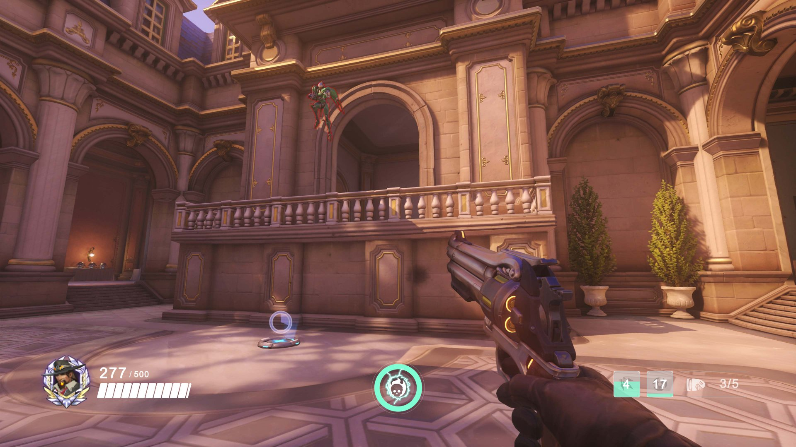

# Overwatch UI Sample for OneJS

An Overwatch style HUD built with [OneJS](https://onejs.com) 3: React 19 rendering through Unity's UI Toolkit. It needs no C#, no Inspector setup and no stylesheet, and its art and font come with it.



## Add it to your project

You need a Unity project (6.3 or newer) with OneJS 3.9.2 or newer and a JSRunner set up by **Initialize Project**. See [Quick Start](https://onejs.com/docs/quickstart) if you don't have that yet.

1. In the JSRunner's working directory (the `~` folder beside its PanelSettings), install the package:

   ```bash
   npm install overwatch-sample
   ```

2. Replace `index.tsx` with:

   ```tsx
   import { render } from "onejs-react"
   import { OverwatchSample } from "overwatch-sample"

   render(<OverwatchSample />, __root)
   ```

3. Save. The edit-mode preview shows the HUD in the Game view, and it runs the same way in Play mode.

A built-in demo drives it: the ultimate charges and crackles when full, health gets an overheal and takes damage, and both abilities cycle through their cooldowns.

## Feed it your game's numbers

Pass `stats` and the demo stops. Anything you leave out keeps its default.

```tsx
<OverwatchSample stats={{ health: 405, maxHealth: 405, ult: 0.6, ammo: 4, maxAmmo: 6 }} />
```

| Prop | What it does |
|------|--------------|
| `stats` | `health` and `maxHealth` (one bar segment per 25), `ult` (0 to 1), `skills`, `ammo`, `maxAmmo` |
| `background` | The picture behind the HUD. `null` for none, to lay the HUD over your own scene |

Each entry in `skills` is `{ icon, cooldown, readyAt }`: a glyph from `Icons`, the cooldown in seconds, and the `Date.now()` time it is ready again. While `readyAt` is in the future, the slot sweeps and counts down by itself.

To read the numbers from C#, use any of OneJS's ways of syncing state, such as `useFrameSync` or `useEventSync` (see [C# Interop](https://onejs.com/docs/core-concepts/csharp-interop)), and pass the result in:

```tsx
import { useFrameSync } from "onejs-react"
import { OverwatchSample } from "overwatch-sample"

// hero is a C# object of yours with these properties.
function Hud({ hero }: { hero: { Health: number, MaxHealth: number, UltCharge: number } }) {
    const health = useFrameSync(() => hero.Health)
    const maxHealth = useFrameSync(() => hero.MaxHealth)
    const ult = useFrameSync(() => hero.UltCharge)
    return <OverwatchSample stats={{ health, maxHealth, ult }} background={null} />
}
```

The parts are exported too, if you want only some of them: `CharacterStats`, `UltMeter` and `ActionBar`. `useDemoStats()` gives you the demo's numbers.

## Player builds

The art ships in the package under `assets/@overwatch-sample/`. In the Editor, the sample copies that folder into your app's `assets/@overwatch-sample/`, the folder OneJS copies into a player build. The copy happens the first time the sample runs in the Editor, so open the scene once (the preview runs it) before your first build. The folder is safe to commit, which is how a build machine that never opens the Editor gets the art.

## How it is made

- Styles are a USS string in `src/styles.ts`, compiled once at load. OneJS's Tailwind plugin does not scan `node_modules`, so a package cannot rely on the app's Tailwind.
- The health bar, the ultimate ring and its lightning are drawn in code with OneJS's batched `Painter`, one crossing into C# per repaint. The lightning's flash and sparks come from the particle engine.
- The icons are glyphs from a small Fontello font made from game-icons.net icons.

## OneJS v1

The original version (OneJS v1, Preact, a `CharacterManager` MonoBehaviour and a ScriptEngine prefab) is on the [`v1` branch](https://github.com/Singtaa/overwatch-sample/tree/v1).

## Credits

See [Attributions.md](Attributions.md). Overwatch is a trademark of Blizzard Entertainment; this sample is not affiliated with or endorsed by Blizzard Entertainment.
